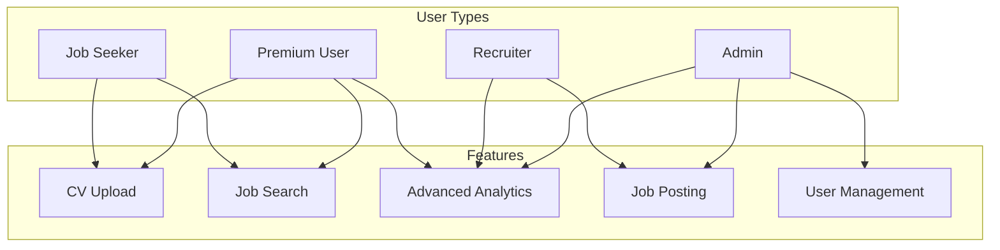
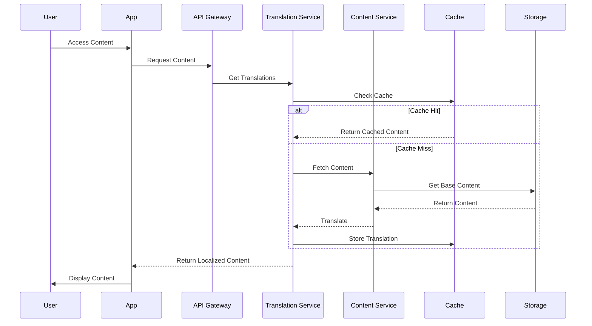
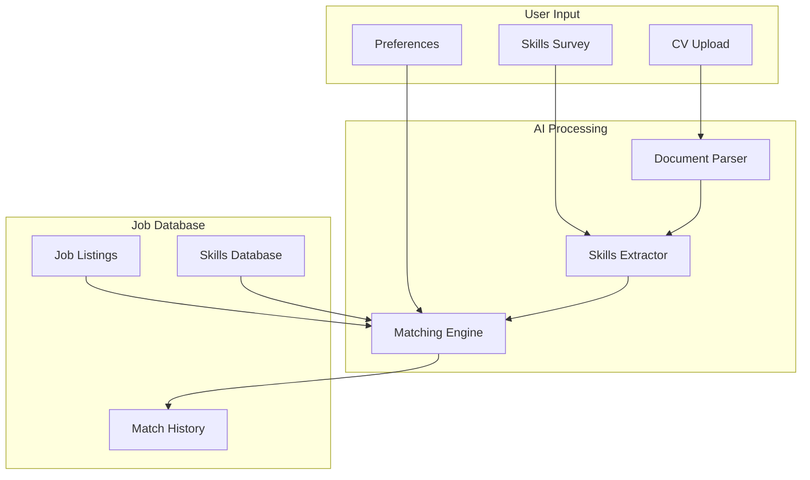
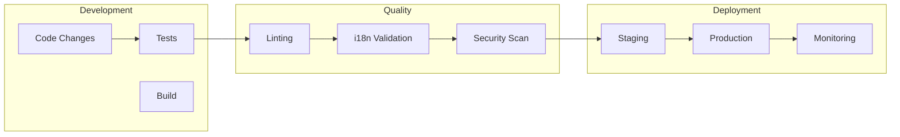
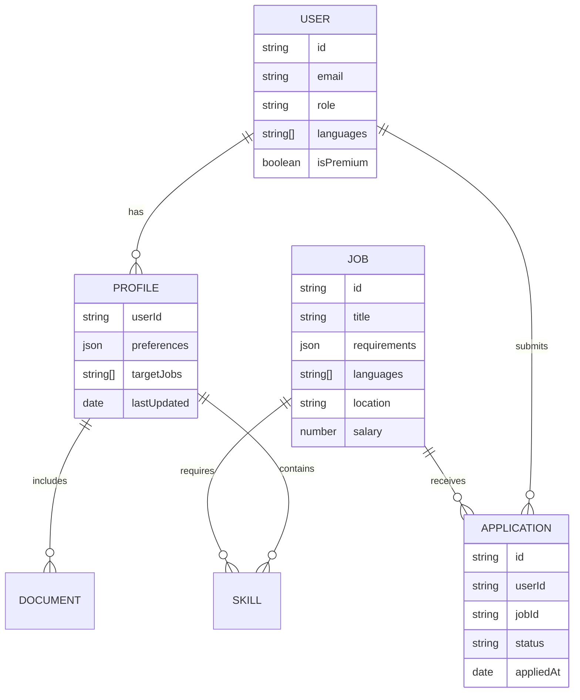
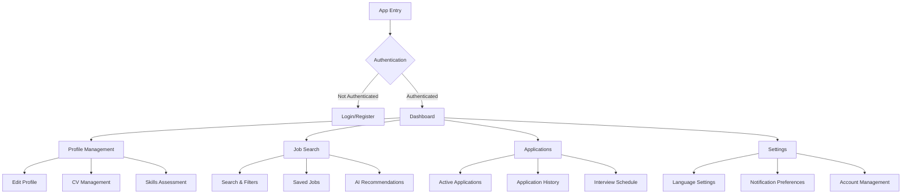

# Mobile Job Application Platform - System Architecture Diagrams

## 1. System Overview with Serverless Architecture
```mermaid
graph TB
    subgraph Mobile Client
        MA[React Native App] --> LC[Language Controller]
        MA --> AC[Auth Controller]
        MA --> JC[Job Controller]
        MA --> PC[Profile Controller]
        MA --> NC[Notification Controller]
    end

    subgraph AWS Cloud Services
        subgraph Lambda Functions
            UserLambda[User Service]
            JobLambda[Job Matching Service]
            ProfileLambda[Profile Service]
            TransLambda[Translation Service]
            NotifyLambda[Notification Service]
        end

        subgraph Storage
            DDB[(DynamoDB)]
            S3[S3 Bucket]
            ElastiCache[(Redis Cache)]
        end

        subgraph Authentication
            Cognito[AWS Cognito]
            IAM[IAM Roles]
        end

        subgraph AI Services
            Comprehend[AWS Comprehend]
            SageMaker[Job Matching ML]
            Translate[AWS Translate]
        end
    end

    subgraph External Services
        TMS[Translation Management]
        Analytics[Analytics Platform]
        CDN[Content Delivery]
    end

    MA --> APIGateway[API Gateway]
    APIGateway --> Lambda Functions
    Lambda Functions --> Storage
    Lambda Functions --> Authentication
    Lambda Functions --> AI Services
```

## 2. User Role and Permission Flow


## 3. Multilingual Content Management Flow


## 4. Job Matching and AI Integration


## 5. CI/CD and Development Workflow


## 6. Data Model and Relationships


## 7. Mobile App Navigation and Screens
