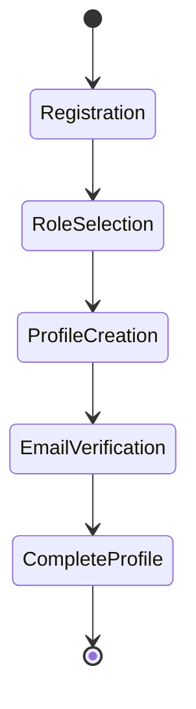
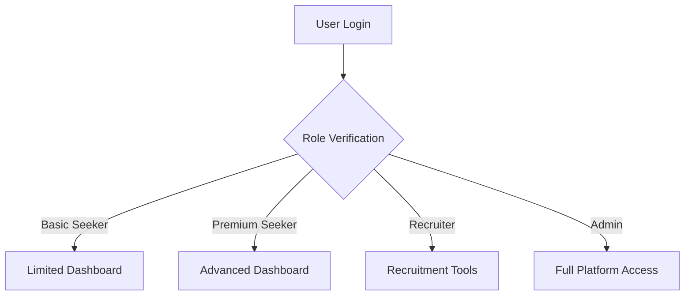

# User Story Mapping - Job Application Platform

## Overall User Journey
### Onboarding and Registration
#### User Roles Coverage:
- Basic Job Seeker
- Premium Job Seeker
- Recruiter
- Career Changer

#### User Stories:
1. As a new user, I want to create an account
   - Choose user role
   - Complete profile creation
   - Verify email/phone

2. As a job seeker, I want to set up my professional profile
   - Upload CV
   - Add work experience
   - List skills
   - Set job preferences

3. As a recruiter, I want to create a company profile
   - Verify company details
   - Add company description
   - Set recruitment goals

## MVP Feature Prioritization

### User Onboarding (Phase 1)
1. Basic Registration
2. Profile Creation
3. Role-based Dashboard
4. Simple Job Search

### Job Seeker Features (Phase 2)
1. CV Builder
2. Job Matching Algorithm
3. Application Tracking
4. Skill Assessment

### Recruiter Features (Phase 3)
1. Job Posting
2. Candidate Filtering
3. Interview Management
4. Reporting Dashboard

## Technical Implementation Considerations

### Authentication Flow

### Role-Based Access Control

## Development Iteration Plan

### Iteration 1: Core Functionality
- User registration
- Basic profile creation
- Simple job search
- Initial matching algorithm

### Iteration 2: Enhanced User Experience
- Advanced profile features
- CV builder
- Skill assessment
- Improved matching

### Iteration 3: Recruiter Tools
- Job posting
- Candidate management
- Interview scheduling

## Risk Mitigation
1. Scalable authentication
2. Flexible role management
3. Performance optimization
4. Data privacy compliance

## Success Metrics
- User registration rate
- Profile completion percentage
- Job application submissions
- User engagement duration
- Matching algorithm accuracy
