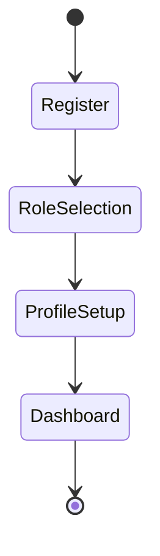
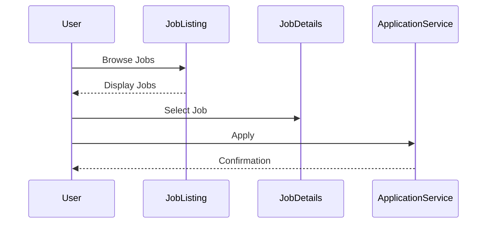

**PRD (Product Requirements Document)** 

---

## Product Requirements Document (PRD)  

### 1. **Functional Requirements by User Role**
#### a. Job Seeker  
- **Basic**: Profile creation, job browsing, basic job applications.  
- **Premium**: Advanced analytics, unlimited applications, detailed skill assessment, and CV building.  
- **Professional**: LinkedIn integration, skill-gap analysis, and advanced job recommendations.  
- **Student**: Focused internships, mentorships, and academic achievements showcase.  
- **Career Changer**: Reskilling resources, industry transition support.  

#### b. Recruiter  
- **Basic Recruiter**: Post job listings, candidate screening.  
- **Enterprise Recruiter**: Advanced filtering, AI-powered tools, analytics.  
- **Talent Specialist**: Strategic tools like employer branding and diversity tracking.  

#### c. Platform Admin  
- User and content management, compliance monitoring, analytics.  

### 2. **Feature Specifications**
- **Job Matching Algorithm**: AI-powered recommendations based on user preferences and profile.  
- **Role-Based Dashboards**: Tailored interfaces for each role, with scalable authentication and granular permissions.  
- **Reporting Tools**: Recruiter-specific analytics.  
- **Communication Tools**: Chat for recruiters and job seekers.

---

### 3. **User Flow Diagrams**
**Onboarding Flow**:

**Job Application Flow**:

---

### 4. **Non-Functional Requirements**
- **Scalability**: Handle high concurrency for peak job searches.  
- **Security**: End-to-end encryption for sensitive data; compliance with GDPR/CCPA.  
- **Performance**: <3 seconds for page load times.  
- **Availability**: 99.9% uptime SLA.  

---

### 5. **Acceptance Criteria**
1. Registration success rate >95%.  
2. Role-based UI navigation matches permissions.  
3. Matching algorithm has 85% user satisfaction.  

---

### 6. **User Story Mapping**
**MVP**:  
- Phase 1: Registration, onboarding, basic job search.  
- Phase 2: Enhanced profiles, CV builder, skill assessment.  
- Phase 3: Recruiter tools.  

**Prioritization**:
1. Basic Registration → Profile Setup → Simple Search → Application Submission.  
2. Advanced Analytics → Matching Algorithm → Job Posting.  

---

## Technical Architecture Design  

### 1. **System Design**
- **Microservices Architecture**:
  - **User Service**: Manages profiles and permissions.  
  - **Job Matching**: AI-based recommendations.  
  - **Notification Service**: Real-time alerts.  

### 2. **API Contracts**
- `POST /api/register`: User registration.  
- `GET /api/jobs`: Fetch job listings.  

### 3. **Database Schema**
- **Users Table**: `user_id`, `role`, `profile_data`.  
- **Jobs Table**: `job_id`, `recruiter_id`, `description`.  

---

## User Experience (UX) Design  

### 1. **Wireframes**
- **Onboarding**: Simple step-by-step form.  
- **Dashboard**: Role-specific metrics.  

### 2. **UI Mockups**
- Clean, minimalistic layout for job seekers.  
- Advanced analytics panel for recruiters.  

### 3. **Prototypes**
- Interactive clickable mockups for registration and job applications.  

---

## Authentication and Authorization Design  

### 1. **Mechanisms**  
- JWT with role-based claims.  
- OAuth2 for third-party integrations (LinkedIn).  

### 2. **Role-Based Access Control (RBAC)**  
- Granular feature permissions as per role matrix.  

### 3. **Secure Token Management**  
- Auto-refresh for tokens; encrypted storage.  

---

## Internationalization Requirements

### Supported Languages (Phase 1)
- English (Default)
- French
- Spanish
- Arabic
- Chinese (Simplified)
- German

### Technical Requirements
1. Translation System
   - Use i18next as the main internationalization framework
   - Implement dynamic translation loading
   - Support for language detection based on:
     * User preferences
     * Browser settings
     * Geographic location
     * Device language

2. Content Management
   - Implement language-specific content storage
   - Support for RTL languages
   - Handle language-specific formatting for:
     * Dates
     * Numbers
     * Currency
     * Names
     * Addresses

3. User Interface
   - Language switcher in app header
   - Persistent language preferences
   - RTL layout support
   - Dynamic font loading
   - Language-specific styling

4. Performance Requirements
   - Lazy loading of language packs
   - Client-side caching of translations
   - Optimized bundle sizes per language
   - Maximum 100ms language switching time

### Data Structure
