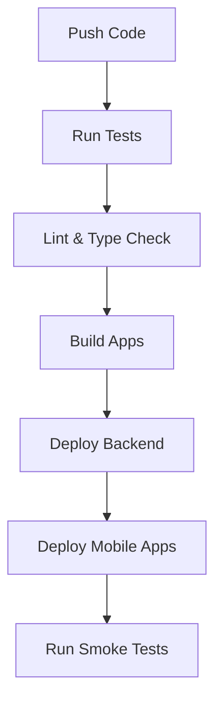

# Task: CI/CD Pipeline Configuration

## Overview
Set up a comprehensive CI/CD pipeline using GitHub Actions for automated testing, building, and deployment of the HireMeKnow mobile application and backend services.

## Task Details

### Prerequisites
- GitHub repository access
- AWS credentials
- Firebase project setup
- Code signing certificates
- Environment secrets configured

### Development Steps

1. GitHub Actions Workflow
```yaml
# .github/workflows/main.yml
name: CI/CD Pipeline

on:
  push:
    branches: [main, develop]
  pull_request:
    branches: [main]

jobs:
  test:
    runs-on: ubuntu-latest
    steps:
      - uses: actions/checkout@v2
      
      - name: Setup Node.js
        uses: actions/setup-node@v2
        with:
          node-version: '16.x'
          cache: 'npm'
          
      - name: Install Dependencies
        run: npm ci
        
      - name: Run Tests
        run: npm run test:ci
        
      - name: Upload Coverage
        uses: codecov/codecov-action@v2
        with:
          token: ${{ secrets.CODECOV_TOKEN }}

  lint:
    runs-on: ubuntu-latest
    steps:
      - uses: actions/checkout@v2
      
      - name: Setup Node.js
        uses: actions/setup-node@v2
        
      - name: Run ESLint
        run: npm run lint
        
      - name: Run TypeScript Check
        run: npm run typescript:check

  build-android:
    needs: [test, lint]
    runs-on: ubuntu-latest
    steps:
      - name: Setup Java
        uses: actions/setup-java@v2
        with:
          distribution: 'adopt'
          java-version: '11'
          
      - name: Build Android App
        run: |
          cd android
          ./gradlew assembleRelease
          
      - name: Upload Android Build
        uses: actions/upload-artifact@v2
        with:
          name: android-release
          path: android/app/build/outputs/apk/release/

  build-ios:
    needs: [test, lint]
    runs-on: macos-latest
    steps:
      - name: Setup Xcode
        uses: maxim-lobanov/setup-xcode@v1
        with:
          xcode-version: '13.0'
          
      - name: Install Pods
        run: |
          cd ios
          pod install
          
      - name: Build iOS App
        run: |
          xcodebuild -workspace ios/HireMeKnow.xcworkspace \
            -scheme HireMeKnow \
            -configuration Release \
            -archivePath $PWD/build/HireMeKnow.xcarchive \
            clean archive

  deploy-backend:
    needs: [test, lint]
    runs-on: ubuntu-latest
    if: github.ref == 'refs/heads/main'
    steps:
      - name: Configure AWS Credentials
        uses: aws-actions/configure-aws-credentials@v1
        with:
          aws-access-key-id: ${{ secrets.AWS_ACCESS_KEY_ID }}
          aws-secret-access-key: ${{ secrets.AWS_SECRET_ACCESS_KEY }}
          aws-region: us-west-2
          
      - name: Deploy to AWS
        run: |
          npm run cdk deploy --all
```

2. Environment Configuration
```yaml
# .github/workflows/environment.yml
name: Environment Setup

env:
  NODE_ENV: production
  STAGE: ${{ github.ref == 'refs/heads/main' && 'prod' || 'dev' }}

jobs:
  setup-env:
    runs-on: ubuntu-latest
    steps:
      - name: Create Environment File
        run: |
          echo "API_URL=${{ secrets.API_URL }}" >> .env
          echo "FIREBASE_CONFIG=${{ secrets.FIREBASE_CONFIG }}" >> .env
```

3. Deployment Scripts
```typescript
// scripts/deploy.ts
import { exec } from 'child_process';
import { promisify } from 'util';

const execAsync = promisify(exec);

async function deploy() {
  try {
    // Deploy backend
    await execAsync('cdk deploy --all');
    
    // Deploy mobile app
    await execAsync('fastlane deploy');
    
    console.log('Deployment successful!');
  } catch (error) {
    console.error('Deployment failed:', error);
    process.exit(1);
  }
}

deploy();
```

## Validation Steps

### 1. Pipeline Testing
```bash
# Test GitHub Actions locally
act -n

# Validate workflow file
npm run workflow:validate

# Test deployment script
npm run deploy:dry-run
```

### 2. Security Checks
```yaml
# .github/workflows/security.yml
name: Security Scan

on:
  push:
    branches: [main, develop]

jobs:
  security:
    runs-on: ubuntu-latest
    steps:
      - name: Run SAST
        uses: github/codeql-action/analyze@v1
        
      - name: Run Dependency Scan
        run: npm audit
```

### 3. Performance Monitoring
```typescript
// scripts/performance-check.ts
async function checkDeploymentPerformance() {
  const startTime = Date.now();
  
  // Deploy and measure
  await deploy();
  
  const duration = Date.now() - startTime;
  if (duration > 1800000) { // 30 minutes
    throw new Error('Deployment took too long');
  }
}
```

## Architecture Guidelines

### Pipeline Structure


### Environment Management
```typescript
// scripts/environment.ts
interface Environment {
  API_URL: string;
  STAGE: 'dev' | 'staging' | 'prod';
  FEATURES: string[];
}

const environments: Record<string, Environment> = {
  dev: {
    API_URL: 'https://api.dev.hiremekow.com',
    STAGE: 'dev',
    FEATURES: ['debug', 'test-mode'],
  },
  prod: {
    API_URL: 'https://api.hiremekow.com',
    STAGE: 'prod',
    FEATURES: [],
  },
};
```

## Documentation Requirements

1. Pipeline Documentation
```markdown
# CI/CD Pipeline

## Workflow Stages
1. Test & Lint
2. Build
3. Deploy
4. Validate

## Environment Setup
- Development
- Staging
- Production

## Security Measures
- Secret Management
- Access Control
- Audit Logging
```

2. Deployment Guide
```markdown
# Deployment Guide

## Prerequisites
1. AWS Credentials
2. Firebase Config
3. App Signing Keys

## Deployment Steps
1. Backend Deployment
2. Mobile App Release
3. Validation Checks
```

## Error Handling

1. Pipeline Error Handling
```yaml
# .github/workflows/error-handling.yml
on:
  workflow_run:
    workflows: ["CI/CD Pipeline"]
    types: [completed]

jobs:
  on-failure:
    runs-on: ubuntu-latest
    if: ${{ github.event.workflow_run.conclusion == 'failure' }}
    steps:
      - name: Notify Team
        uses: actions/slack-notify@v2
        with:
          status: failure
          text: 'Pipeline failed!'
```

## Dependencies
- GitHub Actions
- AWS CDK
- Firebase CLI
- Fastlane
- CodeQL
- Act

## Task Completion Checklist
- [ ] GitHub Actions workflows configured
- [ ] Environment management setup
- [ ] Deployment scripts created
- [ ] Security checks implemented
- [ ] Performance monitoring added
- [ ] Documentation completed
- [ ] Error handling configured
- [ ] Notifications setup
- [ ] Rollback procedures defined
- [ ] Team review conducted
``` 
</rewritten_file>